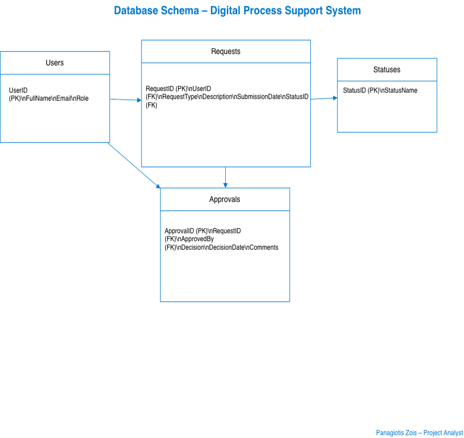
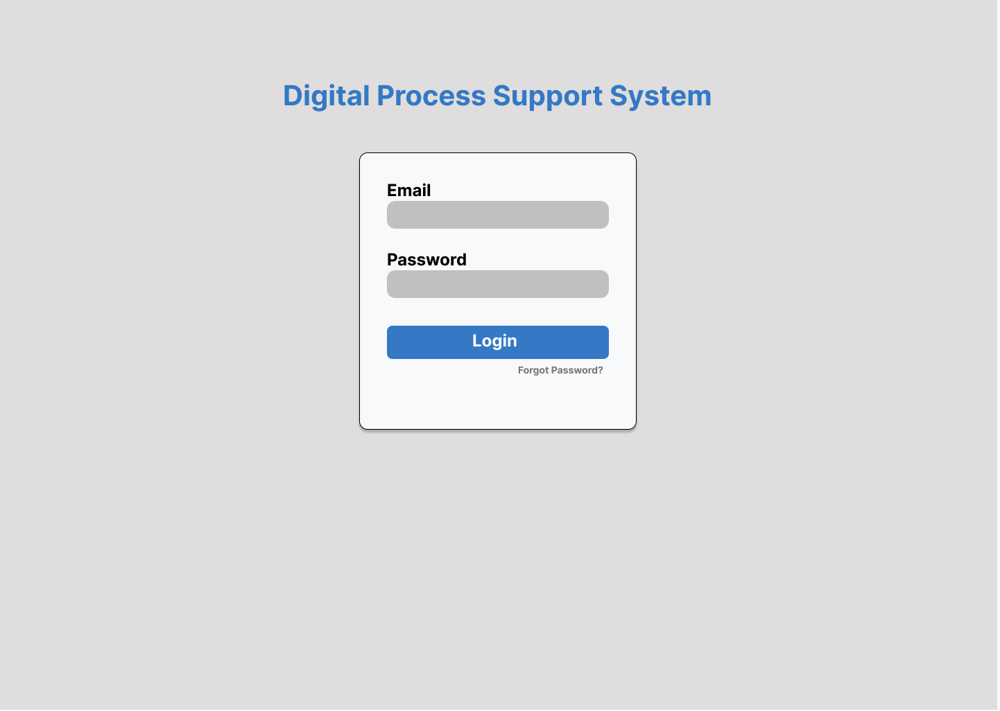
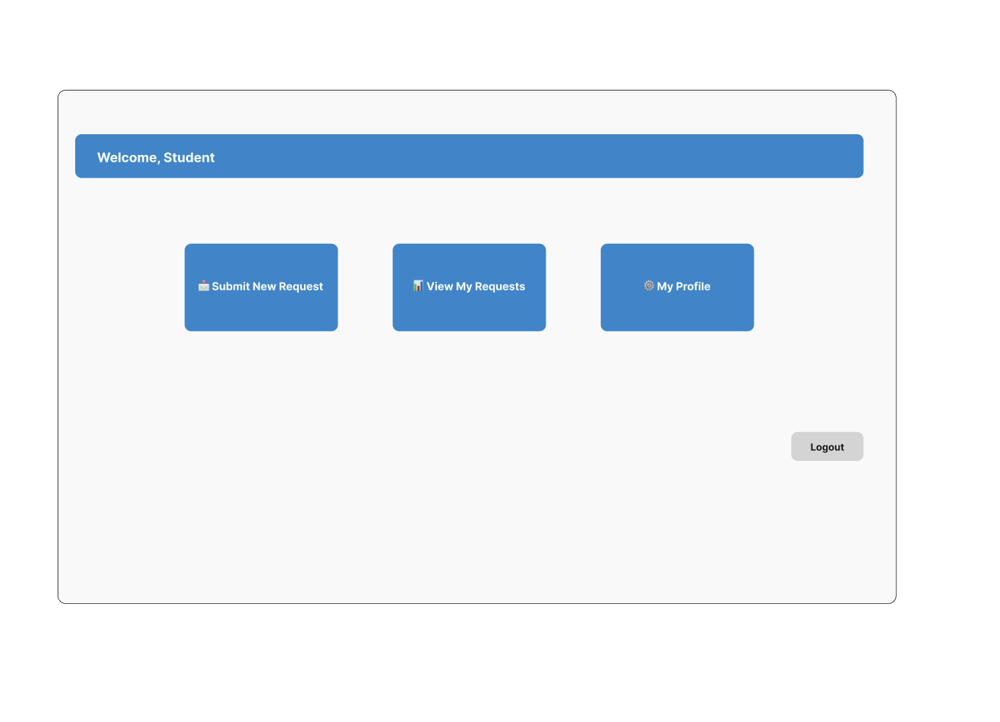

# Digital Process Support System

Enterprise-style internal workflow system simulation designed to demonstrate business process analysis, system architecture thinking, and structured data design.

This project models how an organization could manage internal service requests through a structured digital workflow including submission, approval processes, data tracking, and system documentation.

The goal is to showcase **Business Analyst and ERP-oriented system design thinking**, bridging business requirements with technical system structure.

---

# Project Overview

Organizations frequently handle internal requests such as:

- Administrative requests  
- IT support requests  
- Departmental approvals  
- Process tracking  

Many organizations struggle with:

- Lack of workflow transparency  
- Manual request handling  
- Poor data visibility  
- Delayed approvals  

This project simulates a **Digital Process Support System** that structures these workflows into a centralized digital platform.

---

# System Architecture

The system design follows a simplified enterprise workflow model.

User  
↓  
Request Submission Interface  
↓  
Workflow Processing  
↓  
Department Review  
↓  
Approval / Rejection  
↓  
Status Tracking & Data Storage  

The architecture reflects how internal systems structure operational workflows within organizations.

---

# Repository Structure

    Database/
        Data_Dictionary.xlsx
        digital_process_support_schema.sql

    Diagrams/
        ERD_DatabaseStructure.drawio
        Digital_Process_Support_UseCaseDiagram.drawio

    Prototype/
        FIGMA_Login_Screen.png
        FIGMA_Student_Dashboard.png
        FIGMA_Submit_Request_Screen.png

    Requirements/
        Business_Requirements_Document.docx
        Functional_Requirements_Specification.docx
        Use_Case_Details.docx

    Report/
        Digital_Process_Support_Project_Report.docx

---

# System Diagrams

### Entity Relationship Diagram

This diagram illustrates the data structure supporting the request lifecycle and system entities.

---

# UI Prototype

The system interface was prototyped in Figma to demonstrate user interaction.

### Login Screen

### User Dashboard

The prototype demonstrates how users would interact with the request system.

---

# Business Perspective

The project models a simplified internal workflow platform that could support operational processes such as:

- Request management  
- Workflow approvals  
- Department coordination  
- Process monitoring  

This reflects how internal systems support administrative operations within organizations.

---

# System Perspective

The system architecture includes:

- Business Requirements definition  
- Functional Requirements specification  
- Use Case modeling  
- Database schema design  
- UI prototype  
- System documentation  

This simulates the early design phase of enterprise systems before implementation.

---

# Data Perspective

The project includes a structured database schema designed to support request lifecycle management.

Key entities include:

- Users  
- Requests  
- Departments  
- Request Types  
- Request Status  

A data dictionary is included to document field definitions and data structure.

---

# Process Perspective

The modeled process flow includes:

1. User submits a request  
2. Request is categorized and assigned  
3. Department reviews the request  
4. Decision is recorded (Approved / Rejected)  
5. Request status is updated  
6. Data is stored for monitoring and reporting  

This reflects a simplified workflow automation scenario.

---

# Project Report

A full project report is included containing:

- System overview  
- Requirements analysis  
- Process modeling  
- Database design  
- System documentation  

---

# Author

**Panagiotis Zois**

MSc Student in Information & Communication Technology  
Background in Business Administration  

Interested in:

- ERP systems  
- Business process optimization  
- Data-driven operations  

LinkedIn  
https://www.linkedin.com/in/panagiotiszois

---

# Purpose of the Project

This project was created as a **portfolio case study** to demonstrate skills relevant to roles such as:

- Business Analyst  
- ERP Consultant  
- Process Analyst  
- Systems Analyst  

The focus is on **structured thinking around business processes and system design**, rather than full software implementation.
